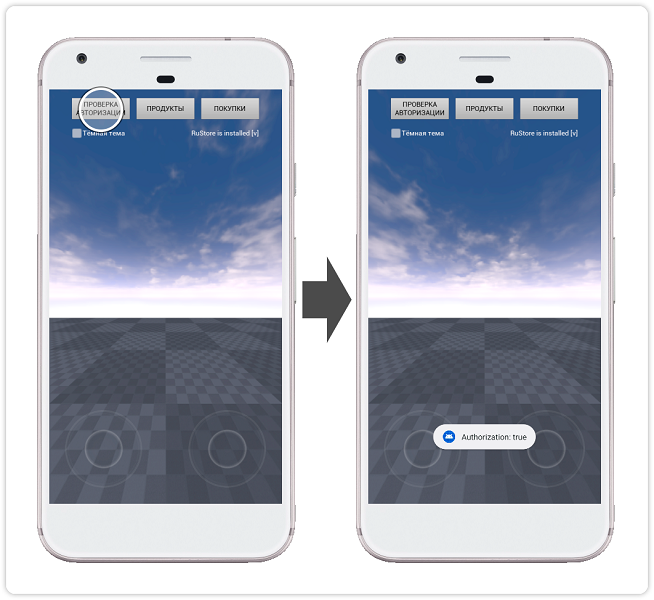
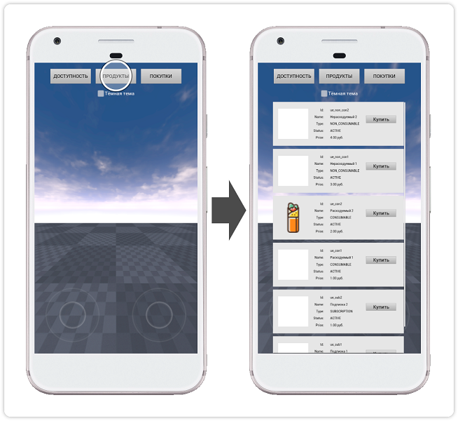
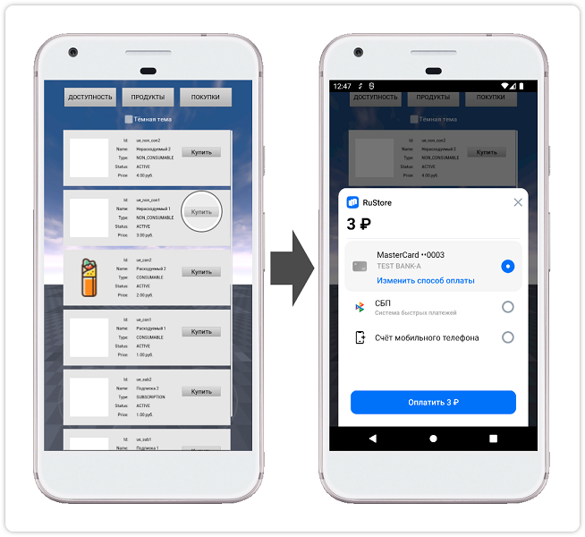

## RuStore Unreal Engine плагин для приема платежей через сторонние приложения

### [🔗 Документация разработчика][10]

- [Условия работы платежей](#Условия-работы-платежей)
- [Подготовка требуемых параметров](#Подготовка-требуемых-параметров)
- [Настройка примера приложения](#Настройка-примера-приложения)
- [Сценарий использования](#Сценарий-использования)
- [Условия распространения](#Условия-распространения)
- [Техническая поддержка](#Техническая-поддержка)

### Условия работы платежей

Для работы проведения платежей необходимо соблюдение следующих условий.

1. На устройстве пользователя установлено приложение RuStore.

2. Пользователь авторизован в приложении RuStore.

3. Пользователь и приложение не должны быть заблокированы в RuStore.

4. Для приложения включена возможность покупок в системе [RuStore Консоль](https://console.rustore.ru/).

> ⚠️ Сервис имеет ограничения на работу за пределами РФ.

### Подготовка требуемых параметров

Для корректной настройки примера приложения необходимо подготовить следующие данные:

1. `applicationId` - уникальный идентификатор приложения в системе Android в формате обратного доменного имени (пример: ru.rustore.sdk.billingexample).

2. `*.keystore` - файл ключа, который используется для [подписи и аутентификации Android приложения](https://www.rustore.ru/help/developers/publishing-and-verifying-apps/app-publication/apk-signature/).

3. `consoleApplicationId` - код приложения из консоли разработчика RuStore (пример: https://console.rustore.ru/apps/123456, `consoleApplicationId` = 123456). Подробная информация о публикации приложений в RuStore доступна на странице [help](https://www.rustore.ru/help/developers/publishing-and-verifying-apps/).

4. `productIds` - [подписки](https://www.rustore.ru/help/developers/monetization/create-app-subscription/) и [разовые покупки](https://www.rustore.ru/help/developers/monetization/create-paid-product-in-application/) доступные в вашем приложении.

### Настройка примера приложения

Для проверки работы приложения вы можете воспользоваться функционалом [тестовых платежей](https://www.rustore.ru/help/developers/monetization/sandbox).

1. В настройках проекта (Edit → Project Settings → Platforms → Android) в поле “Android Package Name” укажите `applicationId` - код приложения из консоли разработчика RuStore.

2. В настройках проекта (Edit → Project Settings → Platforms → Android) в разделе “Distribution Signing” укажите расположение и параметры ранее подготовленного файла `*.keystore`.

3. В файле ресурсов _“Source / RuStoreBillingApp / rustore_billing_values.xml”_ в параметре “rustore_app_id” укажите `consoleApplicationId` из консоли разработчика RuStore.

4. В виджете “UI / BillingClientWidgetBlueprint” в списке “ProductIds” задайте перечень продуктов `productIds` - [подписки](https://www.rustore.ru/help/developers/monetization/create-app-subscription/) и [разовые покупки](https://www.rustore.ru/help/developers/monetization/create-paid-product-in-application/) доступные в вашем приложении.

5. Выполните сборку проекта и проверьте работу приложения.

### Сценарий использования

#### Проверка статуса авторизации у пользователя

Начальный экран приложения не содержит загруженных данных и уведомлений. Тап по кнопке `ПРОВЕРКА АВТОРИЗАЦИИ` выполняет [проверку статуса авторизации][20].

#### Получение списка продуктов

Тап по кнопке `ПРОДУКТЫ` выполняет получение и отображение [списка продуктов][30].

#### Покупка продукта

Тап по кнопке `Купить` выполняет запуск сценария [покупки продукта][40] с отображением шторки выбора метода оплаты.

### Условия распространения

Данное программное обеспечение, включая исходные коды, бинарные библиотеки и другие файлы распространяется под лицензией MIT. Информация о лицензировании доступна в документе [MIT-LICENSE](../MIT-LICENSE.txt).

### Техническая поддержка

Дополнительная помощь и инструкции доступны на странице [rustore.ru/help/](https://www.rustore.ru/help/) и по электронной почте [support@rustore.ru](mailto:support@rustore.ru).

[10]: https://www.rustore.ru/help/sdk/payments/unreal/9-1-0
[20]: https://www.rustore.ru/help/sdk/payments/unreal/9-1-0#getauthorizationstatus
[30]: https://www.rustore.ru/help/sdk/payments/unreal/9-1-0#getproducts
[40]: https://www.rustore.ru/help/sdk/payments/unreal/9-1-0#purchaseproduct
